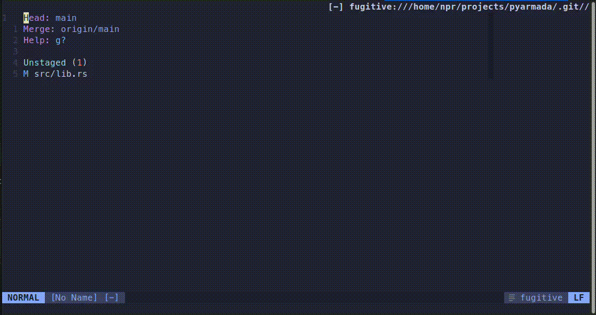

# telescope-cc.nvim

A Telescope integration of [Conventional Commits](https://www.conventionalcommits.org/).



## Installation

```
# vim-plug
Plug 'olacin/telescope-cc.nvim'

# packer
use 'olacin/telescope-cc.nvim'
```

## Usage

```
# As a command
:Telescope conventional_commits

# As a lua function
require('telescope').extensions.conventional_commits.conventional_commits()
```

## Configuration

You can customize action on selection within Telescope `setup()` function.

```lua
telescope.setup({
    ...
    extensions = {
        conventional_commits = {
            theme = "ivy", -- custom theme
            action = function(entry)
                -- entry = {
                --     display = "feat       A new feature",
                --     index = 7,
                --     ordinal = "feat",
                --     value = feat"
                -- }
                print(vim.inspect(entry))
            end,
        },
    },
})

telescope.load_extension("conventional_commits")
```

### Default action

```lua
local cc_actions = {}

cc_actions.commit = function(t, inputs)
    local body = inputs.body or ""
    local footer = inputs.footer or ""

    local cmd = ""

    local commit_message = format_commit_message(t, inputs)

    if vim.g.loaded_fugitive then
        cmd = string.format(':G commit -m "%s"', commit_message)
    else
        print(commit_message)
        cmd = string.format(':!git commit -m "%s"', commit_message)
    end

    if body ~= nil and body ~= "" then
        cmd = cmd .. string.format(' -m "%s"', body)
    end

    if footer ~= nil and footer ~= "" then
        cmd = cmd .. string.format(' -m "%s"', footer)
    end

    print(cmd)

    vim.cmd(cmd)
end

cc_actions.prompt = function(entry, include_extra_steps)
    local inputs = {}

    input("Is there a scope ? (optional) ", "scope", inputs)

    input("Enter commit message: ", "msg", inputs)

    if not inputs.msg then
        return
    end

    if not include_extra_steps then
        cc_actions.commit(entry.value, inputs)
        return
    end

    input("Enter the commit body: ", "body", inputs)

    input("Enter the commit footer: ", "footer", inputs)

    cc_actions.commit(entry.value, inputs)
end
```

### Include body and footer

You can create a command to initiate the extension with the `include_body_and_footer` flag.

```lua
local function create_conventional_commit()
    local actions =
        require("telescope._extensions.conventional_commits.actions")
    local picker =
        require("telescope._extensions.conventional_commits.picker")

    picker({
        action = actions.prompt,
        include_body_and_footer = true,
    })
end

vim.keymap.set(
  "n",
  "cc",
  create_conventional_commit,
  { desc = "Create conventional commit" }
)
```

Or you can setup the extension with `include_body_and_footer` flag included globally.

```lua
local actions =
    require("telescope._extensions.conventional_commits.actions")

telescope.setup({
    ...
    extensions = {
        conventional_commits = {
            action = actions.prompt,
            include_body_and_footer = true,
        },
    },
})
```
